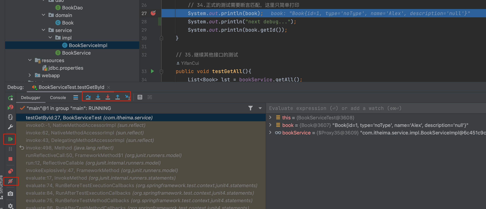
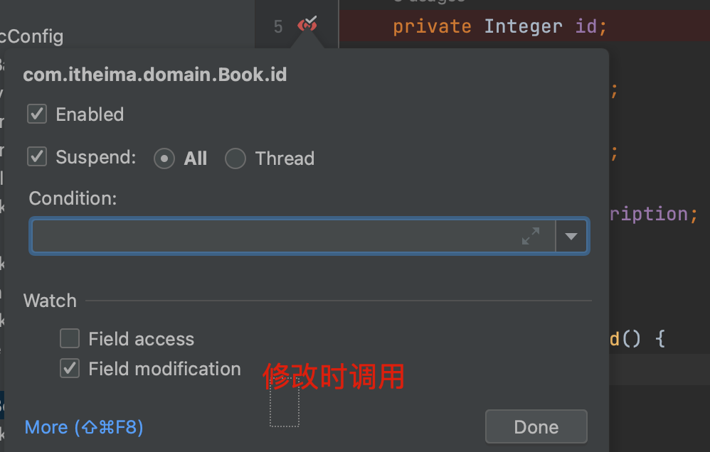
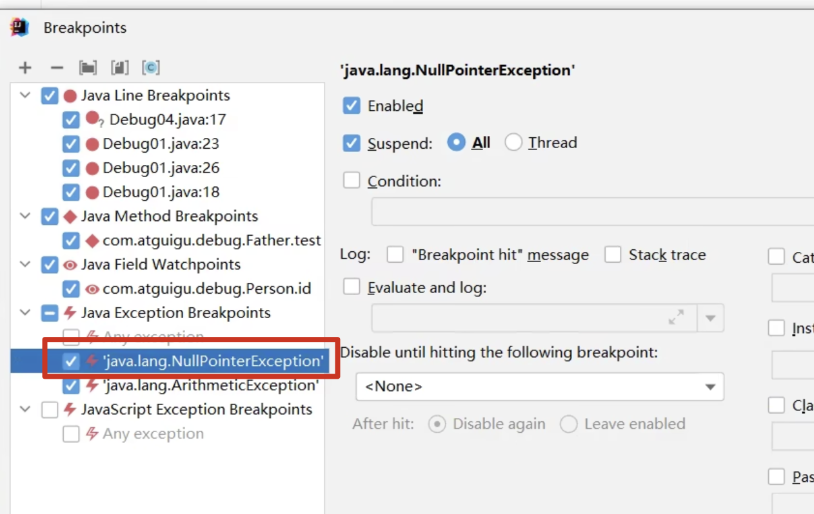
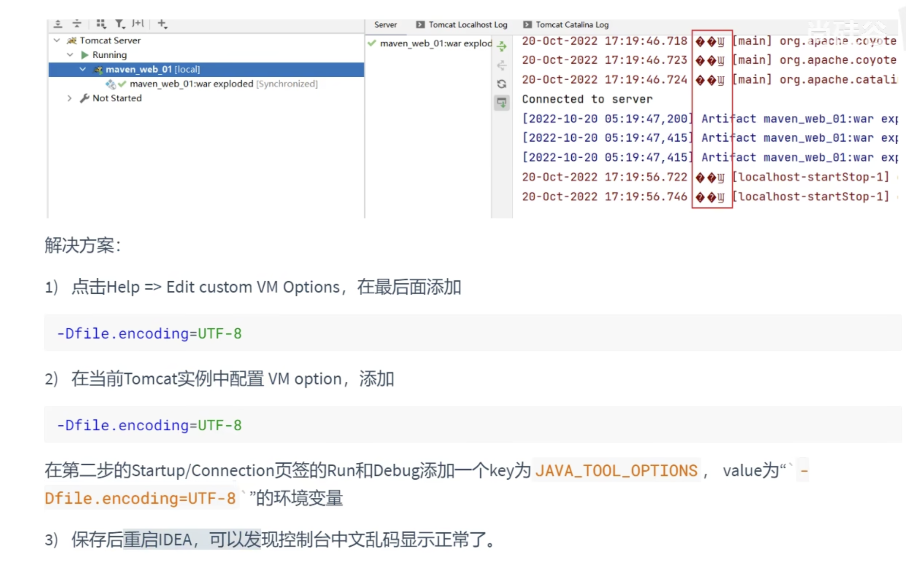

> 视频: [IDEA2022使用技巧](https://www.bilibili.com/video/BV1CK411d7aA/?p=22&spm_id_from=333.1007.top_right_bar_window_history.content.click)

### 项目结构

Project_Module_Package_Class

### Debug

- 方法断点

  - 自定义方法断点
  - 源码方法断点

- 字段断点

  

- 条件断点

- 异常断点

  

### Tomcat部署

- 乱码:

  

- 

