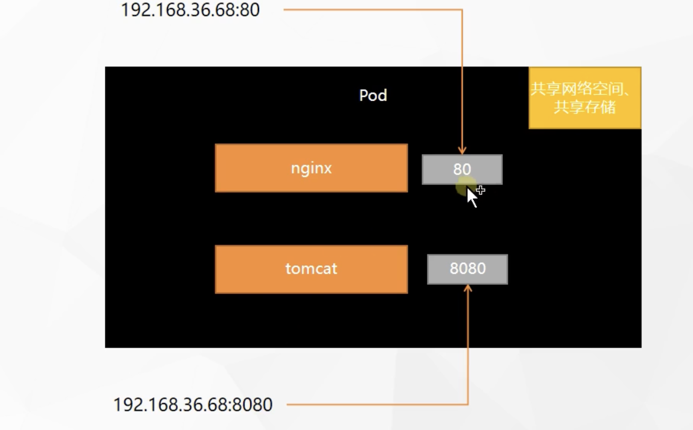
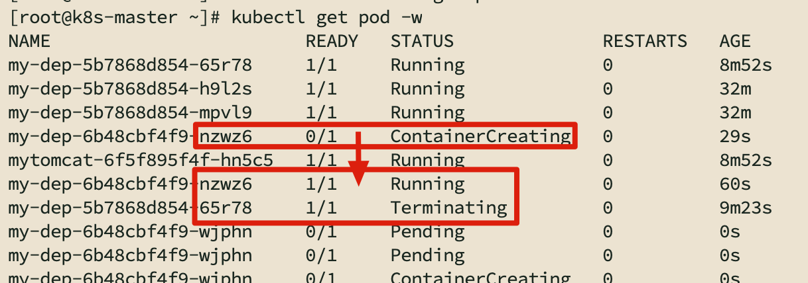
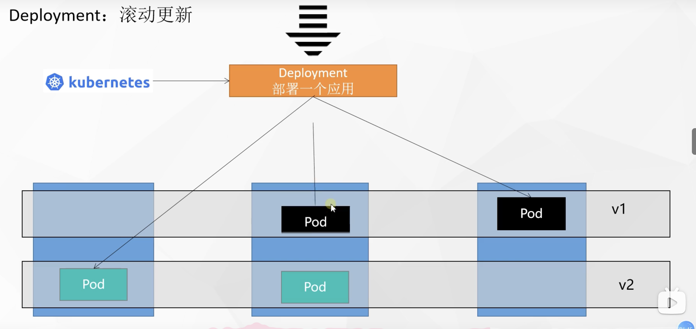
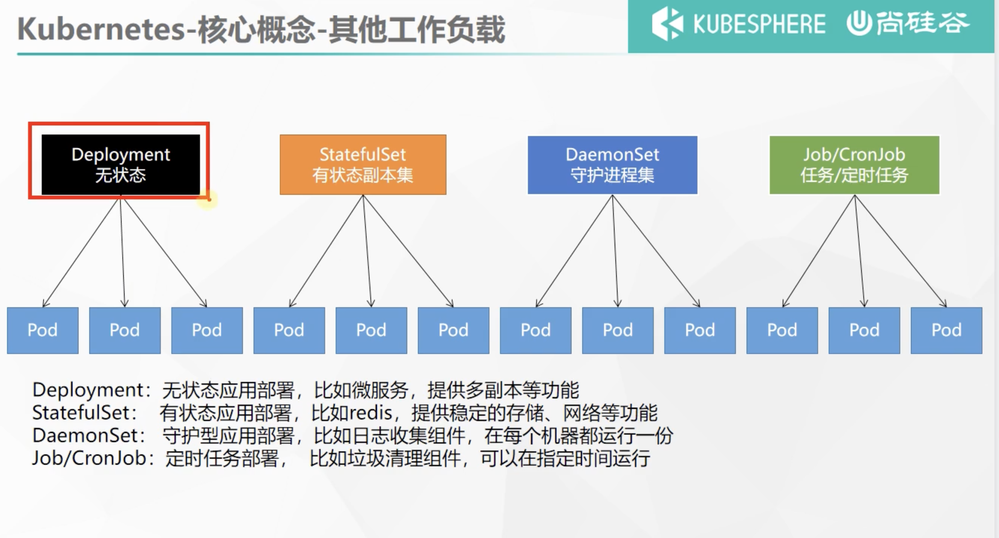
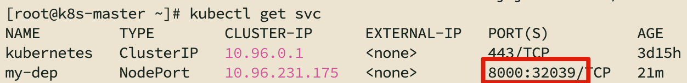
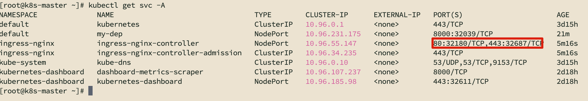
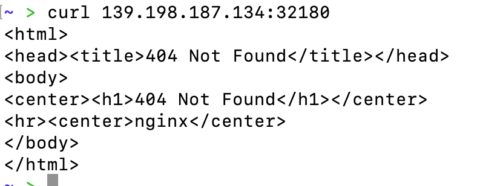
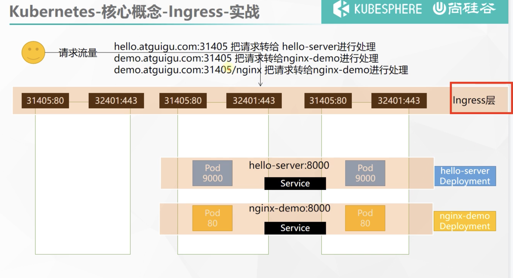
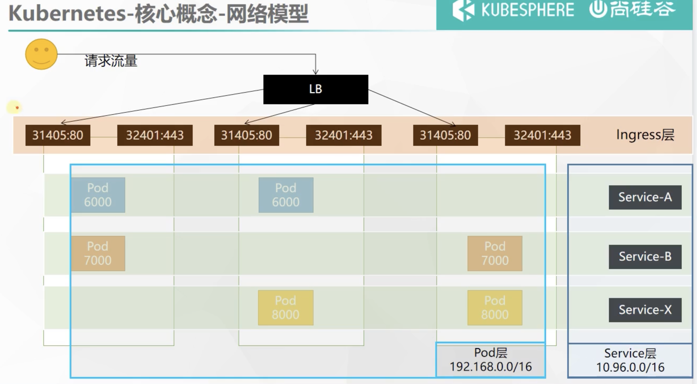

##### 集群搭建

> https://www.yuque.com/leifengyang/oncloud/mbvigg

```bash
#主节点初始化
kubeadm init \
--apiserver-advertise-address=172.31.0.4 \
--control-plane-endpoint=cluster-endpoint \
--image-repository registry.cn-hangzhou.aliyuncs.com/lfy_k8s_images \
--kubernetes-version v1.20.9 \
--service-cidr=10.96.0.0/16 \
--pod-network-cidr=192.168.0.0/16

#所有网络范围不重叠


kubectl get pods -A

#获取访问令牌
kubectl -n kubernetes-dashboard get secret $(kubectl -n kubernetes-dashboard get sa/admin-user -o jsonpath="{.secrets[0].name}") -o go-template="{{.data.token | base64decode}}"

eyJhbGciOiJSUzI1NiIsImtpZCI6ImZaR1pnSUg2MmhLc3lsOFQ3cmJqMzJGekh5eEdXQ1ZuU0tLNG1mY3Njek0ifQ.eyJpc3MiOiJrdWJlcm5ldGVzL3NlcnZpY2VhY2NvdW50Iiwia3ViZXJuZXRlcy5pby9zZXJ2aWNlYWNjb3VudC9uYW1lc3BhY2UiOiJrdWJlcm5ldGVzLWRhc2hib2FyZCIsImt1YmVybmV0ZXMuaW8vc2VydmljZWFjY291bnQvc2VjcmV0Lm5hbWUiOiJhZG1pbi11c2VyLXRva2VuLXhycDJxIiwia3ViZXJuZXRlcy5pby9zZXJ2aWNlYWNjb3VudC9zZXJ2aWNlLWFjY291bnQubmFtZSI6ImFkbWluLXVzZXIiLCJrdWJlcm5ldGVzLmlvL3NlcnZpY2VhY2NvdW50L3NlcnZpY2UtYWNjb3VudC51aWQiOiI0YWYzNWYwYS0yMzczLTQyMTYtYTMwZS0zNzUxOWQxMWMxNmIiLCJzdWIiOiJzeXN0ZW06c2VydmljZWFjY291bnQ6a3ViZXJuZXRlcy1kYXNoYm9hcmQ6YWRtaW4tdXNlciJ9.fdktl1RKK_SbDS82wxnGO16uD3Xy_lMqpSKMZaclxu2u8jJ4h0dy17Sk4BiGIi2kcrohvN0MRxXgQ6vG03YGRNxajr-keL7tmtDTRReP3orRU0VjAvuOZJ9kMnUeYx-03ORwMu8VwKsW5j_k_WXXorJHgSIPAIBNYCjATn0S25hBekrquXt0CPME_el3CsO55xUloyzX83qKgJ5VosprAs-ds2R5_rf7E8Tv3GfS_NSgHSvLXmcbQSngLBgWXfwSF3pq3jz0J0szjeJjdqBeEZq93oB3nCi6Mo1fth0-HmwVBenZ9Bn5zrSjgk_072-qx6PoWgOakAuUG1TtmpofRQ
```


##### 命令空间Namespace

```bash
# 创建命名空间
kubectl create ns hello
# 删除命名空间
kubectl delete ns hello
```

```yaml
apiVersion: v1
kind: Namespace
metadata:
  name: hello
```

##### Pod

- 一个Pod是一或多个容器的集合

```bash
# 创建pod
kubectl run mynginx --image=nginx
# 查看事件
kubectl describe pod mynginx
```

> 小飞飞：不指定节点/pod的亲和性和反亲和性的话，都是随检分配到worknode上的

```yaml
apiVersion: v1
kind: Pod
metadata:
  labels:
    run: mynginx
  name: mynginx
#  namespace: default
spec:
  containers:
  - image: nginx
    name: mynginx
```

```bash
# 查看日志
kubectl logs mynginx
kubectl logs -f mynginx

# 每个Pod - k8s都会分配一个ip
kubectl get pod -owide
# 使用Pod的ip+pod里面运行容器的端口
curl 192.168.169.136

kubectl exec -it mynginx -- /bin/bash

# 集群中的任意一个机器以及任意的应用都能通过Pod分配的ip来访问这个Pod
```

```yaml
apiVersion: v1
kind: Pod
metadata:
  labels:
    run: myapp
  name: myapp
  namespace: default
spec:
  containers:
  - image: nginx
    name: nginx
  - image: tomcat:8.5.68
    name: tomcat
```



若配置了端口冲突: 会报错`Back-off restarting failed container`, 日志nginx2 in myapp-2里有`Address already in use`

```yaml
apiVersion: v1
kind: Pod
metadata:
  labels:
    run: myapp-2
  name: myapp-2
  namespace: default
spec:
  containers:
  - image: nginx
    name: nginx
  - image: nginx
    name: nginx2
```


##### Deployment

> 控制Pod，使Pod拥有多副本，自愈，扩缩容等能力

```bash
# 清除所有Pod，比较下面两个命令有何不同效果？
kubectl run mynginx --image=nginx

kubectl create deployment mytomcat --image=tomcat:8.5.68
# 自愈能力
# delete pod后会自动起一个新的pod,需要执行delete deploy
```

- 多副本

```bash
kubectl create deployment my-dep --image=nginx --replicas=3
```

```yaml
apiVersion: apps/v1
kind: Deployment
metadata:
  labels:
    app: my-dep
  name: my-dep
spec:
  replicas: 3
  selector:
    matchLabels:
      app: my-dep
  template:
    metadata:
      labels:
        app: my-dep
    spec:
      containers:
      - image: nginx
        name: nginx
```

- 扩所容

```bash
kubectl scale --replicas=5 deployment/my-dep

kubectl edit deployment my-dep
#修改 replicas,保存并退出
```

- 故障转移

```bash
# 故障允许事件默认为5m
# 把node1的服务器关机,则node1上的pod会过5分钟被k8s检测到不正常,则会在其他node上新建pod
```


- 滚动更新: 新的Pod状态为running之后, 则删除上一个Pod

```bash
# 更新Pod使用的镜像
kubectl set image deployment/my-dep nginx=nginx:1.16.1 --record
```





- 版本回退

```bash
#历史记录
kubectl rollout history deployment/my-dep

#查看某个历史详情
kubectl rollout history deployment/my-dep --revision=2

#回滚(回到上次)
kubectl rollout undo deployment/my-dep

#回滚(回到指定版本)
kubectl rollout undo deployment/my-dep --to-revision=2
```

##### 工作负载



##### Service

- ClusterIp

```bash
# 等同于没有--type的
kubectl expose deployment my-dep --port=8000 --target-port=80 --type=ClusterIP
# 在Pod中通过域名访问
curl my-dep.default.svc:80
# 删除svc
kubectl delete service my-dep
```

```yaml
apiVersion: v1
kind: Service
metadata:
  labels:
    app: my-dep
  name: my-dep
spec:
  ports:
  - port: 8000
    protocol: TCP
    targetPort: 80
  selector:
    app: my-dep
  type: ClusterIP
```

- NodePort

所有的Pod都会开通同一个NodePort端口

```bash
kubectl expose deployment my-dep --port=8000 --target-port=80 --type=NodePort
# 在集群内,通过ClusterIP:Port访问(此处ClusterIP是NodePort的IP)
curl 10.96.231.175:8000
# 通过公网IP+NodePort访问,是请求随机Pod服务
curl 139.198.187.134:32039
```



```yaml
apiVersion: v1
kind: Service
metadata:
  labels:
    app: my-dep
  name: my-dep
spec:
  ports:
  - port: 8000
    protocol: TCP
    targetPort: 80
  selector:
    app: my-dep
  type: NodePort
```

> NodePort范围在 30000-32767 之间

##### Ingress

- 理论


```bash
wget https://raw.githubusercontent.com/kubernetes/ingress-nginx/controller-v0.47.0/deploy/static/provider/baremetal/deploy.yaml

#修改镜像
vi deploy.yaml
#将image的值改为如下值：
registry.cn-hangzhou.aliyuncs.com/lfy_k8s_images/ingress-nginx-controller:v0.46.0

# 检查安装的结果
kubectl get pod,svc -n ingress-nginx

# 最后别忘记把svc暴露的端口要放行
```

实际上是使用nginx+NodePort实现的



```bash
# 通过公网IP+Ingress访问,是直接请求Ingress的Nginx服务
curl 139.198.187.134:32180
```



- 实战



服务配置

```
apiVersion: apps/v1
kind: Deployment
metadata:
  name: hello-server
spec:
  replicas: 2
  selector:
    matchLabels:
      app: hello-server
  template:
    metadata:
      labels:
        app: hello-server
    spec:
      containers:
      - name: hello-server
        image: registry.cn-hangzhou.aliyuncs.com/lfy_k8s_images/hello-server
        ports:
        - containerPort: 9000
---
apiVersion: apps/v1
kind: Deployment
metadata:
  labels:
    app: nginx-demo
  name: nginx-demo
spec:
  replicas: 2
  selector:
    matchLabels:
      app: nginx-demo
  template:
    metadata:
      labels:
        app: nginx-demo
    spec:
      containers:
      - image: nginx
        name: nginx
---
apiVersion: v1
kind: Service
metadata:
  labels:
    app: nginx-demo
  name: nginx-demo
spec:
  selector:
    app: nginx-demo
  ports:
  - port: 8000
    protocol: TCP
    targetPort: 80
---
apiVersion: v1
kind: Service
metadata:
  labels:
    app: hello-server
  name: hello-server
spec:
  selector:
    app: hello-server
  ports:
  - port: 8000
    protocol: TCP
    targetPort: 9000
```

Ingress配置

```yaml
apiVersion: networking.k8s.io/v1
kind: Ingress  
metadata:
  name: ingress-host-bar
spec:
  ingressClassName: nginx
  rules:
  - host: "hello.atguigu.com"
    http:
      paths:
      - pathType: Prefix
        path: "/"
        backend:
          service:
            name: hello-server
            port:
              number: 8000
  - host: "demo.atguigu.com"
    http:
      paths:
      - pathType: Prefix
        path: "/nginx"  # 把请求会转给下面的服务，下面的服务一定要能处理这个路径，不能处理就是404(可以在Pod里给nginx添加nginx资源,就可以访问到了)
        backend:
          service:
            name: nginx-demo  ## java，比如使用路径重写，去掉前缀nginx
            port:
              number: 8000
```

```bash
# 修改配置文件
kubectl edit ing ingress-host-bar
```

- 路径重写

```yaml
apiVersion: networking.k8s.io/v1
kind: Ingress  
metadata:
  annotations:
    nginx.ingress.kubernetes.io/rewrite-target: /$2
  name: ingress-host-bar
spec:
  ingressClassName: nginx
  rules:
  - host: "hello.atguigu.com"
    http:
      paths:
      - pathType: Prefix
        path: "/"
        backend:
          service:
            name: hello-server
            port:
              number: 8000
  - host: "demo.atguigu.com"
    http:
      paths:
      - pathType: Prefix
        path: "/nginx(/|$)(.*)"  # 把请求会转给下面的服务，下面的服务一定要能处理这个路径，不能处理就是404
        backend:
          service:
            name: nginx-demo  ## java，比如使用路径重写，去掉前缀nginx
            port:
              number: 8000
```

- 流量限制

```yaml
```

- K8S总结-网络模型



##### 存储抽象

- 原声方式挂载

- PV/PVC

  ```bash
  kubectl apply -f pv.yaml
  kubectl apply -f pvc.yaml
  kubectl get pv
  ```

- 创建P V

  ```yaml
  apiVersion: v1
  kind: PersistentVolume
  metadata:
    name: pv01-10m
  spec:
    capacity:
      storage: 10M
    accessModes:
      - ReadWriteMany
    storageClassName: nfs
    nfs:
      path: /nfs/data/01
      server: 172.31.0.4
  ---
  apiVersion: v1
  kind: PersistentVolume
  metadata:
    name: pv02-1gi
  spec:
    capacity:
      storage: 1Gi
    accessModes:
      - ReadWriteMany
    storageClassName: nfs
    nfs:
      path: /nfs/data/02
      server: 172.31.0.4
  ---
  apiVersion: v1
  kind: PersistentVolume
  metadata:
    name: pv03-3gi
  spec:
    capacity:
      storage: 3Gi
    accessModes:
      - ReadWriteMany
    storageClassName: nfs
    nfs:
      path: /nfs/data/03
      server: 172.31.0.4
  ```

- 创建PVC

  ```yaml
  kind: PersistentVolumeClaim
  apiVersion: v1
  metadata:
    name: nginx-pvc
  spec:
    accessModes:
      - ReadWriteMany
    resources:
      requests:
        storage: 200Mi
    storageClassName: nfs
  ```

  

- Pod绑定PVC

  ```yaml
  apiVersion: apps/v1
  kind: Deployment
  metadata:
    labels:
      app: nginx-deploy-pvc
    name: nginx-deploy-pvc
  spec:
    replicas: 2
    selector:
      matchLabels:
        app: nginx-deploy-pvc
    template:
      metadata:
        labels:
          app: nginx-deploy-pvc
      spec:
        containers:
        - image: nginx
          name: nginx
          volumeMounts:
          - name: html
            mountPath: /usr/share/nginx/html
        volumes:
          - name: html
            persistentVolumeClaim:
              claimName: nginx-pvc
  ```

- ConfigMap

  ```yaml
  apiVersion: v1
  data:    #data是所有真正的数据，key：默认是文件名   value：配置文件的内容
    redis.conf: |
      appendonly yes
  kind: ConfigMap
  metadata:
    name: redis-conf
    namespace: default
  ```

  
