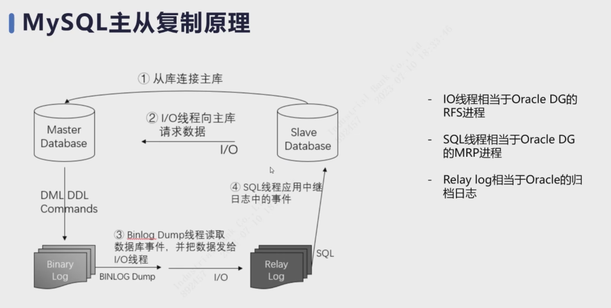
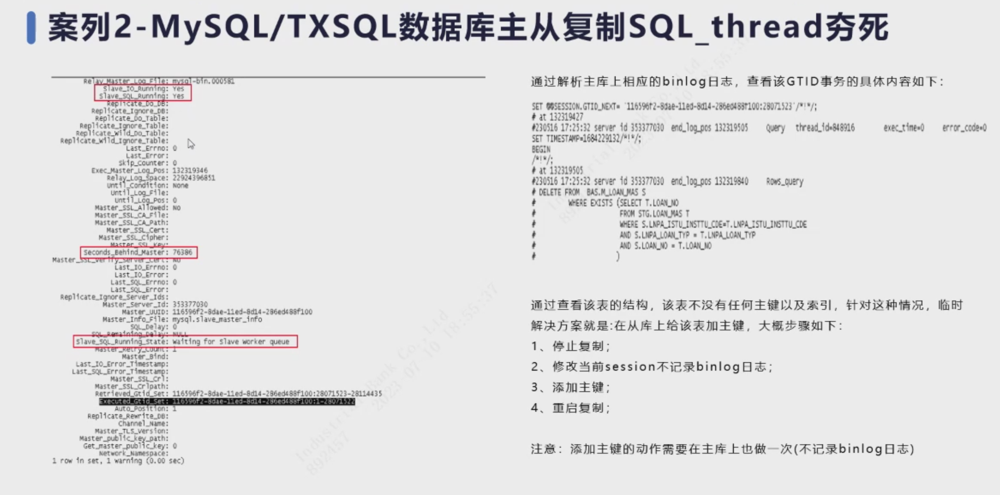

### 0619-内存

##### 共享内存


##### 私有内存

- 性能测试时尽量避免生成磁盘临时表, 而是只生成内存临时表.

  

- 内存计算

  

  共享内存是固定的, 私有内存可以估算.

##### 内存监控


- IO_CACHE为连接数


##### 内存分配器

```bash
systemctl status mysqld_3306
vi /etc/systemd/system/mysqld_3306.service
# jemalloc
ps -ef | grep mysql
# 查看malloc的路径
lsof -p $pid | grep malloc
```

TXSQL独有的内存展示

```sql
show detail processlist\G
```


内存分配器对比


并发很大时, jemalloc的优势凸显出来了, 表明了在动态地释放内存给系统


##### 业务场景


##### 性能测试


- innodb_buffer_pool_size不建议超过60%

测试环境开放了所有的监控, 智慧库上有:


### 0706-代码走差

##### 常见问题


##### 案例分享

****

- 两周一个迭代, 是否下发取决于业务需求


##### 走查实践


##### webhooks


##### 代码库中新建模板

.gitlab/issue_templates


- 设计0.5~1天,走查半小时


- 需求一般不超过8人天


### 0710-MySQL主从复制

##### 主从原理




##### 常用指标


- seconds_behind_master计算, 这是一个估计值. 比如主给从发了3个binlog, 但因网络原因只传到了1个, 且从执行完了. 这是seconds_behind_master就是0, 但其实还差了2个binlog


- 主从线程常见状态

##### 案例-大事务导致从库IO_thread异常


日志文件过大, 默认为250M, 但实际到了4G


- 解决办法: 拆分
  - 场景如千万数据, 没建索引

##### 案例-SQL_thread夯死




- 二级索引与回放


- 主键与回放

##### 案例-哈希值相等主从复制错误


- CRC32


- 大表DDL方案
  - 建索引, truncate, 加字段等: 使用其他工具
  - 大量insert: 比如2000w, 那就分5*400w插入
    - 用一个insert语句, 写**400w个value**值
- 外键导致主从异常
  - 建议尽量少用外键