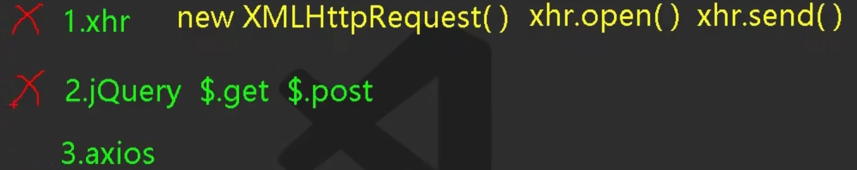

- ajax原生: 
- node.js很简单的，比这个框架还要简单 
- 发送网络请求只分为 xhr 和 fetch 
- jquery和axios都是封装xhr的，fetch是原生的
- promise风格
- 总之，promise源码必须牢记最好手写，也就五六十行而已

- 跨域
  - 协议，域名和端口要一致
  - 解决跨域
    - cors：根本上解决
    - jsonp：开发基本不用，面试常用
    - 代理服务器：开发中用的多
    - 服务器之间不用ajax
    - 代理服务器开启方法
      - 1.配置类方式(实现WebMvcConfigurer)
      - 2.使用@CrossOrigin注解
      - 3.使用nginx反向代理解决跨域
      - 4.Vue中配置代理服务器
        - devServer，有缺陷
        - devServer+前缀：真实项目就是这样的（nginx也是这样配的）
          - 请求就加前缀，不请求就不加。只要有请求前缀，就不会向本地内容拿数据了
          - 
          - pathRewrite:现在官方修复了这个问题了
    - 总结一下，两种代理方式，前端写代码常用DevServer正向代理，代理浏览器，仅限开发阶段，项目上线后，使用Nginx反向代理，代理服务器，后端人员编写
    - 正向代理客户端，反向代理服务器
    - 这里8080向自己的服务器发请求，自己的服务器8080向服务器5000发请求，中转一下
    - public相当于服务器的跟路径，如./pulbic/test.txt，则有localhost:8080/test.txt
    - 