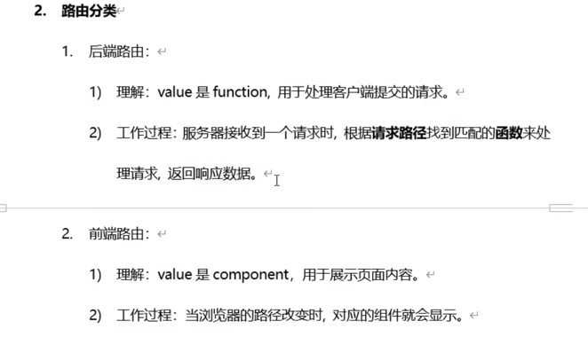

### 路由
- 单页面应用：
  - single page web application(SPA)
  - 特点
    - 整个应用只有一个完整的页面
    - 导航链接不会刷新页面，只局部更新
    - 数据通过ajax获取（axios是实现ajax的库，底层是promise实现的，ajax是一个标准）
  - 实现方法：
    - iframe耗内存
- 路由分类
  - 前端路由/后端路由：
- 路由的两种工作模式
  - hash模式和history模式  

1、路由：同样的位置，组件可”动态化“，可不断改变（核心：实现动态特性）  2、插槽：同样的组件，组件结构一样，组件中指定内容可”选择化“（核心：复用了组件的结构）

>实际开发中 都会是使用动态路由
> 