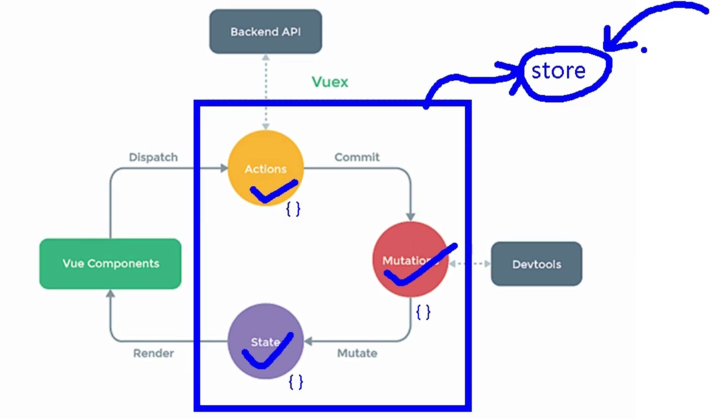

### VueX
##### 逻辑图

##### 搭建Vuex环境
- ES6：import命令的执行会提到文件开头
- Vue.use(Vuex)写到./store/index.js里（项目里就是这么写的，如果下边替换成modules模块，就更完美了）
- context的作用？

> 弹幕：
> - 做项目时，有时候用actions这个获取用户权限
> - actions中可进行异步请求，业务逻辑处理，
> - 越听越像MVC 视图  控制器 业务逻辑
> - 个人见解这个图结构类似于vuecom：view，actions：controller，mutation：service，state：mapper结构，这样后端同学好理解
> - actions和mutations分开：
>   - 这里两个组件组件直接的耦合性从“内容耦合”（一个模块直接使用另一模块的数据）变成了“控制耦合”（一个模块调用另一模块时，传递的是控制信号，被调用的模块根据控制信号的值，有选择的执行功能）
>   - 耦合性，指的是组件间依赖关系的强弱程度。
>   - 这里说一下问什么不写在mutations里面：mutations是直接与state交互的，就相当于dao层，业务逻辑和数据持久化当然要分开写，不仅解耦合，而且业务层代码可以实现代码复用
> - mutation只能写纯函数

